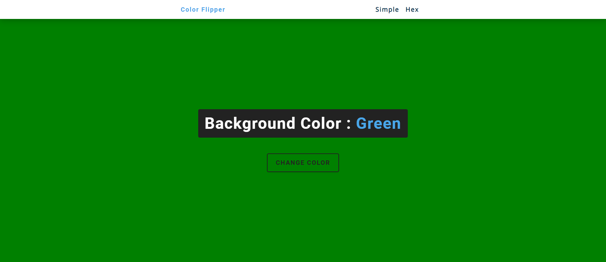

# JS - Color Flipper Project
**Key concepts covered:**
- arrays
- document.getElementById()
- document.querySelector()
- addEventListener()
- document.body.style.backgroundColor
- Math.floor()
- Math.random()
- array.length

##### Main Task:
Select Body tag to make change on Background color
Also make changes on the text 

- Use addEventListener
- Create New function to get reandom number

[Project Live link](https://cpazad.github.io/Color-Flipper/)
- - -
*Md. Azadur Rahman*  
[Fiverr Link](https://www.fiverr.com/cpazad) 
[Twitter Link](https://twitter.com/freedombyte)